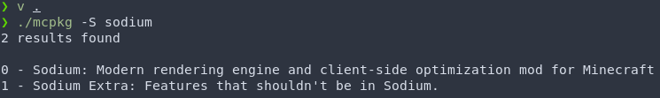

# MCPKG
A tool to update Minecraft mods written in V.

:warning: Right now, this is a **very** work in progress project and it is far from usable or stable. 

## About
MCPKG is a **work in progress** tool to automatically download and update Minecraft mods. 

When 1.0 is done, MCPKG will scan you installed mods and compare their version number to the ones online. If the local mods are older, it will try to update them to the new ones. 

The primary mod platform that I'll support for 1.0 will be [Modrinth](https://modrinth.com/), an open source collection of open source Minecraft mods with a very nice api. However, I plan to code flexibly enough so that new sources could be added in the future.

## Wishlist
I'd like to call this section "planned features," but right now I'm only 'planning' to get the bare minimum done. Here's some features that I'd like to have, but might not get to. 

Features wishlist:
- [ ] Notify user when a new version of a mod is available.
- [ ] Download mods to mods folder
- [ ] Combine first two into a nice script
- [ ] Handle dependencies / library mods
- [ ] Search for and install new mods
- [ ] Upgrade all mods to new preferred version of Minecraft. 
- [ ] Mod folders / profiles (eg `1.16`, `1.17 Optifine`, `1.17 Sodium`)
- [ ] Texture / resource packs support?
- [ ] Shader pack support???

Sources wishlist:
- [ ] Modrinth
- [ ] Github
- [ ] Fabric
- [ ] Forge?
- [ ] Optifine
- [ ] Curseforge?
- [ ] Planet Minecraft??

## Dependencies and running MCPKG
MCPKG is written in [V](https://vlang.io/), but it doesn't need any other dependancies.

After installing V, clone and enter this repo and type `v run .` to start mcpkg. If you want to build the project, it's simply `v .`. 

You can install V from
- [V's website](https://vlang.io/)
- [V's Github](https://github.com/vlang/v)
- [The AUR](https://aur.archlinux.org/packages/vlang/)
	- This version may be a bit out of date since is still under rapid development.

